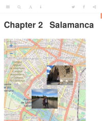

<!-- README.md is generated from README.Rmd. Please edit that file -->

```{r, include = FALSE}
knitr::opts_chunk$set(
  collapse = TRUE,
  comment = "#>",
  fig.path = "man/figures/README-",
  out.width = "100%"
)
```

# photomapr

<!-- badges: start -->
[](https://travis-ci.org/robinlovelace/photomapr)
[](https://ci.appveyor.com/project/robinlovelace/photomapr)
<!-- badges: end -->

The goal of photomapr is to make it easier to create photomaps.
A photomap is an interactive map which shows the location of places where photos have been taken.
Ideally, photomaps should be able to display the photo of interest when you click on it.

## Why create your own photomaps?

Photomaps and photo albums are a great way to share experiences and remember good times.
A good example of a photomap is that created by default by [Flickr](https://www.flickr.com/photos/97888609@N02/sets/72157704719583382/map) when an album of geotagged photos has been created.
The image below shows a publicly available Flickr photomap, showing photos taken during a cycling holiday from the Knepp Estate rewilding project to Lewes, which ended by passing though [Marble Arch](https://www.independent.co.uk/environment/climate-change-protest-extinction-rebellion-london-oxford-street-waterloo-a8870206.html) in London.

[](https://www.flickr.com/photos/97888609@N02/sets/72157704719583382/map)

This approach has limitations, however.
You must sign-up to Flickr and other services that create photomaps 'in the cloud', creating a barrier to entry.
Furthermore, creating a photomap online often involves sending valuable and sometimes highly personal data to corporations.
That can be problematic, as outlined in the [book](https://www.amazon.com/Team-Human-Douglas-Rushkoff/dp/039365169X) and [podcast series Team Human](https://teamhuman.fm/) by Douglas Rushkoff.

This package aims to make it easy to create photomaps locally
and, if you want, deploy the results online.
An example of photomaps is [bookdown.org/robinlovelace/madrid-santiago-2019](https://bookdown.org/robinlovelace/madrid-santiago-2019/), a photomap developed using an early version of this package, a screenshot of which is shown below (see [here](https://github.com/katyrobin/madrid-santiago-2019) to see how the package was used to create this photobook containing photomaps).

[](https://bookdown.org/robinlovelace/madrid-santiago-2019/)

## Installation

Install development version from [GitHub](https://github.com/) with:

``` r
# install.packages("devtools")
devtools::install_github("robinlovelace/photomapr")
```

## Usage

The first stage is to decide the photos you want.
The package cannot help you with that, but once you do have a number of photo files, represented by `photo_files` below, you can convert them to a geographic data frame with the function `photos_sf()`:

```{r example}
library(photomapr)

(photo_files = geotagged_photo_paths())
photos_geo = photos_sf(photo_files)
plot(photos_geo["DateTimeOriginal"], key.pos = 1)
```

Let's create a simple photomap, using data shipped in the package:

```{r, eval=FALSE}
photomap(photo_files)
```


You can also preview your photos with a slideshow in RStudio:

```{r, eval=FALSE}
slideshow(photo_files) 
```

## How it works

The package works bringing together functionality from a number of excellent packages, including:

- [`leaflet`](https://github.com/rstudio/leaflet) for interactive maps
- [`magick`](https://github.com/ropensci/magick) which provides powerful tools for image processing
- [`exifr`](https://github.com/paleolimbot/exifr) for extracting metadata (critically the GPS location) from photos
- [`sf`](https://github.com/r-spatial/sf) for providing a class system for spatial data

Thanks to the developers of these packages, and to everyone making and using open source software.
Without you this project would be impossible.

## Example workflow

<details>

```{r, eval=FALSE}
library(tidyverse)
photos_zip = "/media/robin/T7/ColwallHerefordshire/Colwallgeotaggedimages.zip"
photos_path = gsub(pattern = ".zip", replacement = "", x = photos_zip)
dir.create(photos_path)
unzip(zipfile = photos_zip, exdir = photos_path)
list.files(photos_path)
photos_path = file.path("/media/robin/T7/ColwallHerefordshire/Colwallgeotaggedimages/mPix12Oct/")
list.files(photos_path)
photos_files = list.files(photos_path, full.names = TRUE)
p_sf = photos_sf(photos_files)
photos_to_keep = 1:9
p_sf_test = p_sf |> 
  slice(photos_to_keep) |> 
  transmute(file = basename(path = SourceFile)) |> 
  mutate(file = paste0('<a href="', file, '">', file, '</a>'))

dir.create("testphotofolder")
file.copy(from = photos_files[photos_to_keep], to = "testphotofolder")
f = list.files("testphotofolder", full.names = TRUE)
library(leaflet)
l = leaflet() |> 
  addTiles() |> 
  addMarkers(data = p_sf_test, popup = p_sf_test$file)
l
htmlwidgets::saveWidget(widget = l, file = "testphotofolder/index.html")
browseURL("testphotofolder/index.html")
p_sf_test
system("zip -r testphotofolder.zip testphotofolder")
piggyback::pb_upload("testphotofolder.zip")
piggyback::pb_download_url("testphotofolder.zip")
```


</details>


## Next steps

- Clicking on photos in photomap opens photo
- Auto-generation of photo albums with maps
- Deployment of photomaps online?


