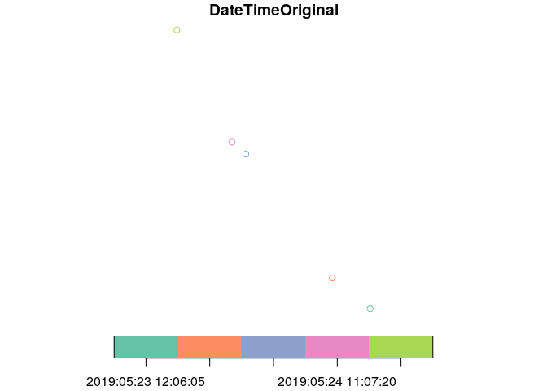

<!-- README.md is generated from README.Rmd. Please edit that file -->

# photomapr

<!-- badges: start -->

<!-- badges: end -->

The goal of photomapr is to make it easier to create photomaps. A
photomap is an interactive map which shows the location of places where
photos have been taken. Ideally, photomaps should be able to display the
photo of interest when you click on it.

A good example of a photomap is that created by default by
[Flickr](https://www.flickr.com/photos/97888609@N02/sets/72157704719583382/map)
when an album of geotagged photos has been created. The image below
shows a publicly available Flickr photomap, showing photos taken during
a cycling holiday from the rewilding project at the Knepp Estate to
[Marble
Arch](https://www.independent.co.uk/environment/climate-change-protest-extinction-rebellion-london-oxford-street-waterloo-a8870206.html)
in
London.

[](https://www.flickr.com/photos/97888609@N02/sets/72157704719583382/map)

This approach has limitations, however. You must sign-up to Flickr and
other services that create photomaps ‘in the cloud’, creating a barrier
to entry. Furthermore creating a photomap online often involves handing
over your valuable data to a multinational for-profit corporation. That
is problematic, as outlined in the book Team Human.

## Installation

Install development version from [GitHub](https://github.com/) with:

``` r
# install.packages("devtools")
devtools::install_github("robinlovelace/photomapr")
```

## Usage

Let’s create a simple photomap, using data shipped in the package:

``` r
library(photomapr)

(photo_files = geotagged_photo_paths())
#> [1] "/home/robin/R/x86_64-pc-linux-gnu-library/3.6/photomapr/photos/IMG_20190523_120605_logo.jpg"
#> [2] "/home/robin/R/x86_64-pc-linux-gnu-library/3.6/photomapr/photos/IMG_20190523_135034_logo.jpg"
#> [3] "/home/robin/R/x86_64-pc-linux-gnu-library/3.6/photomapr/photos/IMG_20190524_104545_logo.jpg"
#> [4] "/home/robin/R/x86_64-pc-linux-gnu-library/3.6/photomapr/photos/IMG_20190524_110720_logo.jpg"
#> [5] "/home/robin/R/x86_64-pc-linux-gnu-library/3.6/photomapr/photos/IMG_20190524_200945_logo.jpg"
photos_geo = photos_sf(photo_files)

plot(photos_geo$geometry)
```



You can also preview your photos with a slideshow in RStudio, thanks to
[`magick`](https://github.com/ropensci/magick):

``` r
slideshow(photo_files) 
```

## Next steps

  - Show how to create interactive maps
  - Auto-generation of photo albums with maps
